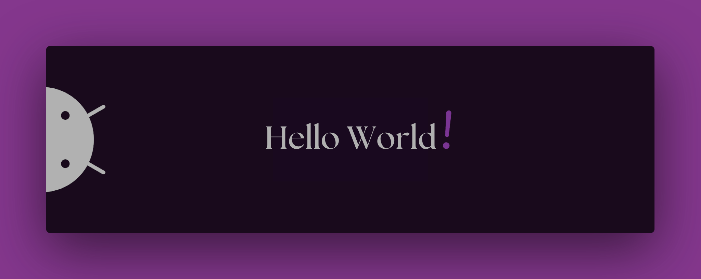

Programador. Estudante. Entusiasta de IA.
------------------------------------

<!-- Imagem de banner -->

    <!-- Contador de visitas -->
    

### Sobre mim
* 🚀  4º semestre de ciência da computação
* ✉️  Me contate [ricardo.23.03.1749@gmail](mailto:ricardo.23.03.1749@gmail.com)
* 🧠  Estou aprendendo tudo de React
* 🖥️  Veja mais em [sites.google.com](https://sites.google.com/view/ricardoag/home)
* 🌍  Morando em Sorocaba, SP

### Meus dados
> 📦 190.8 MB Usado no armazenamento do GitHub 
 > 
> 🏆 221 Contribuições no ano de 2024
 > 
> 📜 21 Repositórios Públicos 
 > 
> 🔑 7 Repositórios Privados 
 > 

### Habilidades
  <!-- Imagem adicional -->
  

  <!-- Icones de habilidades -->
  
  
  
  
  
  
  
  
  
  
  

### Principais Linguagens

  <!-- Gráfico de linguagens mais usadas -->
  

### Redes Sociais

  <!-- Links para redes sociais -->
  
  
  
  
  

### Sistemas

  <!-- Icones de sistemas operacionais -->
  
  
  
  
  
  
  
  

<!-- Seção Visão Futuro -->
# 🔮 Visão de Futuro

- 🌱 **Próximos Passos**: Aprofundar conhecimentos em desenvolvimento full-stack.
- 🚀 **Objetivo de 5 Anos**: Tornar-me líder técnico em uma empresa inovadora.
- 🎯 **Missão**: Contribuir para a construção de tecnologias que impactam positivamente a sociedade.

<!-- Seção Certificações -->
# 🎓 Certificações e Cursos

| Certificação            | Plataforma             | Data de Conclusão |
| ----------------------- | ---------------------- | ----------------- |
| Desenvolvedor React     | Udemy                  | Maio 2023         |
| Certificação JavaScript | FreeCodeCamp           | Dezembro 2022     |
| Introdução ao Git       | Coursera               | Agosto 2021       |

<!-- Seção de Depoimentos -->
# 🗣️ Depoimentos

> “Trabalhar com o Ricardo foi uma experiência incrível. Sua dedicação e habilidade técnica são excepcionais!”  
> — João Silva, Desenvolvedor Front-end

> “Ele sempre traz soluções criativas e tem um ótimo entendimento do produto.”  
> — Maria Oliveira, Gerente de Produto

<!-- Seção Paleta de Cores -->
# 🎨 Paleta de Cores do Meu Projeto

| Cor           | Hex       | Uso                   |
| ------------- | --------- | --------------------- |
| Azul Escuro   | `#0A192F` | Fundo Principal       |
| Azul Claro    | `#64FFDA` | Destaques e Links     |
| Branco        | `#FFFFFF` | Texto Principal       |
| Cinza Escuro  | `#8892B0` | Texto Secundário      |

<!-- Links para redes sociais com ícones -->

  <!-- Instagram -->
  
  <!-- LinkedIn -->
  
  <!-- WhatsApp -->
  
  <!-- Gmail -->
  

